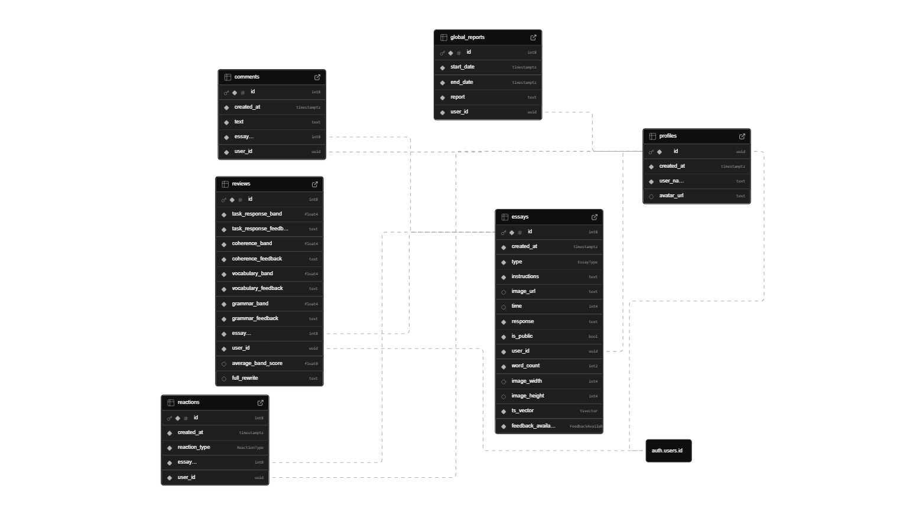

<div align="center">
   

   <p style="font-size: 28px; font-weight: bold">IELTS Write Coach</p>

   <div style="display: flex; justify-content: center; gap: 5px; margin-bottom: 15px">
   

   

   
   </div>

   <p style="margin-bottom: 10px">Write IELTS essays, receive structured AI feedback, track your progress through analytics, and share your essays with the community.</p>

[Web version](http://ielts-writecoach.expo.app/) | [Download APK](https://drive.google.com/file/d/1F2u3pjY-u-95GfxeawhvFhEQ1cw0ZUni/view?usp=sharing)

---

</div>

<div align="left">

# 📱 Demo

<table>
<tr>
<td style="font-weight: bold">Write</td>

<td style="font-weight: bold">Feedback</td>

<td style="font-weight: bold">Public feed</td>

<td style="font-weight: bold">Analytics</td>
</tr>

<tr>
<td></td>

<td></td>

<td></td>

<td></td>
</tr>
</table>

---

# 🤔 Why IELTS WriteCoach?

- Write, store, review, and share your essays in one place - no multitooling needed.
- AI prompts used under the hood are already tailored to get honest and structured feedback every time.
- Get improvement recommendations from both AI and other people.
- Access your data across different devices and platforms.
- No paid features - it's all free!

# ✅ Core features

## ✏️ Writing essays

- Include instructions
- Attach a chart image for Task 1
- Timer and word counter
- Save a draft of your essay
- Filter, sort, and search your works

## ✨ AI review

- Get your strengths, weaknesses, and improvement suggestions for the official criteria
- Get a high-band version of your essay
- Get global report on your essay: recurring strengths, recurring weaknesses, most prominent weakness, priority recommendations

## ❤️ Community

- Share your essays with others
- Five types of reactions
- Comments

## 📊 Analytics

- Band scores line graph
- Writing pace line graph
- Reaction types bar chart
- Essay types pie chart

# 🎯 Purpose of this project

This project was built as a portfolio project to explore:

- AI-assisted education tools
- Full-stack development with Supabase
- Cross-platform apps with Expo

# 💻 Tech stack

## Frontend

- Expo
- Gluestack/UI
- React Hook Form
- Zod
- TanStack/Query
- Lucide Icons
- NativeWind
- Victory Native

## Backend

- Supabase
- Google AI Studio (Gemini)

## Dev tools

- Typescript
- Eslint
- Prettier

# 😽 Get started

1. Clone the repository

```bash
git clone https://github.com/IhorAntiukhov/ielts-writecoach.git
```

2. Install dependencies

```bash
npm install
```

3. Set environment variables in `.env.local`

```
EXPO_PUBLIC_SUPABASE_API_KEY=
EXPO_PUBLIC_GEMINI_API_KEY=
```

> **Note**: You can obtain these keys from:
>
> - Supabase project settings
> - Google AI Studio

4. Run the project

```bash
npm run start
```

# 🗄️ Database Schema



# 🌟 Help others

If you find this project useful, consider starring it!

This might help other students find it and improve their performance.

# 📄 License

This project is licensed under the MIT license.

</div>
